# *User Manual*

## Description

The Project Workflow Manager (PWFM) is a calendar application for users to
manage their projects, view dependencies, create project phases, and manage
assignment and visibility of phases to assigned workers.

## Creating an account (Steven)

When the application launches, the login screen is displayed. If you
do not have an account, click the **"Register"** button to create one.

  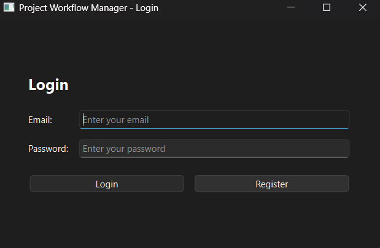

The account creation window opens. The Email field accepts
either a username or an email address. Password requirements may vary
depending on system configuration. Type in both the desired username/email
and password, confirm your password in the **"Confirm Password"** field,
and click **"Create"**.

*Note: email/usernames are unique within the system.*

  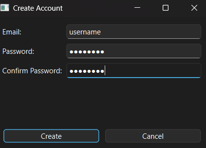

**Result:** A success confirmation appears. Click **"OK"** and proceed to Login.

  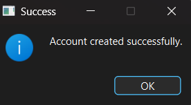

### Common Errors

Account creation may fail for multiple reasons. Here are some common
errors and how to resolve them:
- **Error: All fields are required**
  - Cause: One or more fields were left blank.
  - Solution: Complete all fields and click "Create".
- **Error: An account with that email already exists**
  - Cause: The entered username/email is already in use.
  - Solution:
    - If using a username: choose a different username.
    - If using an email: contact your organization.
- **Error: Passwords do not match**
  - Cause: Password and Confirm Password fields differ.
  - Solution: Re-enter both fields and click **Create**.

## Login (Pedro)

When you launch the application, the first screen you will see is the login window.

  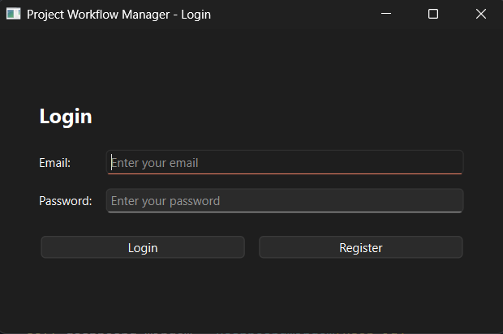

To log in, follow these steps:

1.  **Email:** In the first field, enter the email address you registered with.
2.  **Password:** In the second field, enter your password.
3.  **"Login" Button:** Click the `Login` button.

If your credentials are correct, the application will grant you access to the main Dashboard. If there is an error (e.g., incorrect password or email), you will receive a notification and can try again.

## Creating a Project (Owen)

To create a project, first click on the "Create Project" button located in the upper left hand corner of the Dashboard. 

  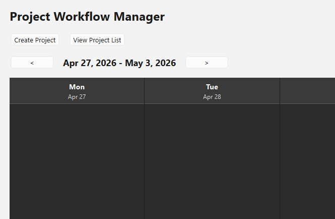

This will bring you to the Create Project Window.

  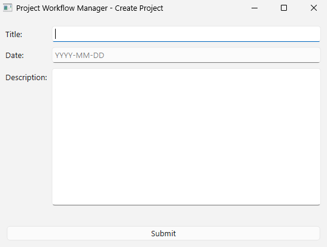

To create a new project, complete the following steps:

1.) Type the Name of your project into the Title field.

2.) Type the Due Date for your project into the Date field using the YYYY-MM-DD date format.

3.) Type the Description you want for your project into the descrioption box.

4.) Click Submit

*Note: Project Titles are unique within the system.*

  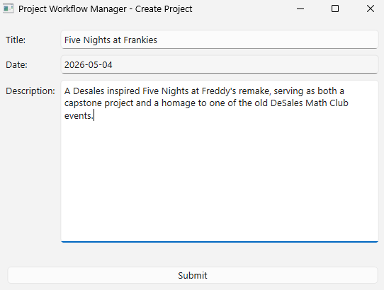

Result: A success confirmation appears. Clicking "OK" will close the Create Project Window and return you to the Dashboard.

  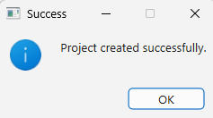

### Common Errors

Project Creation may fail for multiple reasons. Here are some common
errors and how to resolve them:
- **Error: All fields are required**
  - Cause: One or more fields were left blank.
  - Solution: Complete all fields and click "Submit".
- **Error: An project with that title already exists**
  - Cause: The entered already exists for another project within the system.
  - Solution:
    - Choose a different name for the project.

## Modifying a Project (Pedro)

You can easily update a project's due date or description by following these three simple steps.

### Step 1: Select the Project

First, locate and click on the project you wish to modify. You can find your projects on the main **Dashboard** calendar or in the **Project List**. Clicking the project will open its **Project Details** window.

  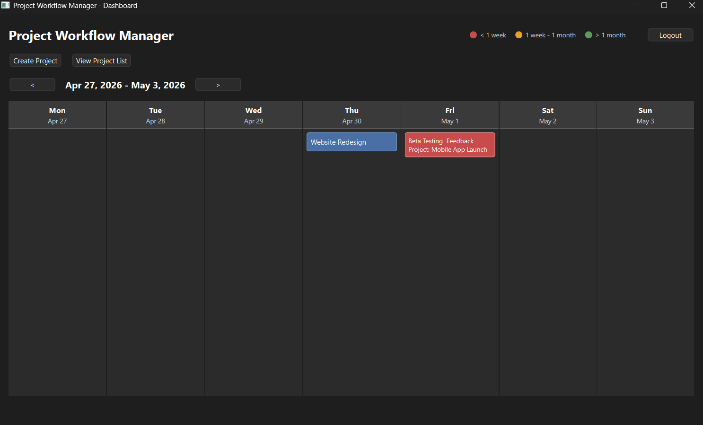

### Step 2: Click the "Modify Project" Button

In the **Project Details** window, you will find a `Modify Project` button. Click this button to open the project modification screen, where the project's current details will be pre-filled and ready for editing.

  

### Step 3: Modify and Save Changes

You can now change the **Due Date** or update the **Description**. Once you are finished making your changes, click the `Save Changes` button to update the project.

  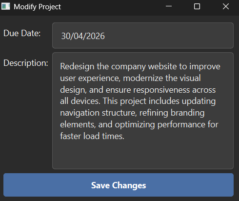

Your project is now updated. The new details will be reflected immediately on the main **Dashboard**.

## Creating a Phase (Steven)

After creating a project and viewing its details, you can add phases
to organize and track project work.

From the **Project Details** window, click the **"Add Phase"** button
to open the phase creation window.

  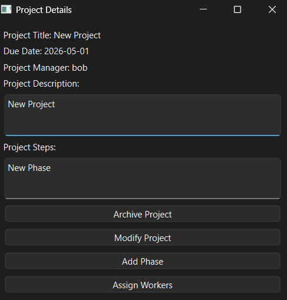

In the phase creation window, enter the following information:
- Phase Title
- Due Date (formatted as `YYYY-MM-DD`)
- Steps (description or list of tasks associated with the phase)

After entering the required information, click **"Submit"**.

  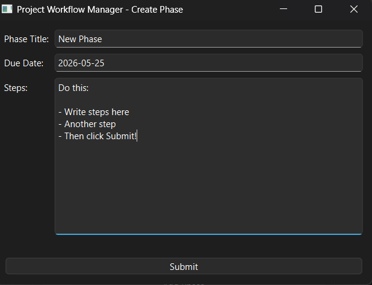

**Result:** A confirmation message will appear indicating that the phase
was created successfully. Click **"OK"** to continue.

  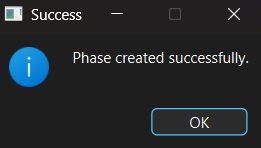

### Viewing a Phase

Once created, the phase will appear on the calendar under its assigned
due date.

Phases are color-coded based on their proximity to the current date:
- Green  → Over a month away
- Yellow → Between a week and a month
- Red    → Less than a week or past due

  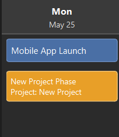

### Viewing Phase Details

Click on a phase within the calendar to view its details, including:
- Project Title
- Phase Title
- Due Date
- Steps / Description

  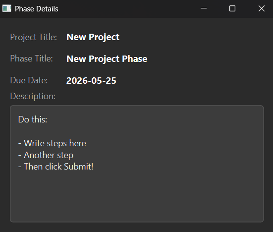

### Common Errors

Phase creation may fail for multiple reasons. Here are some common
errors and how to resolve them:
- **Error: Phase title and due date are required.**
  - Cause: Either Phase title or Due Date is empty.
  - Solution: Fill in both required fields and click **"Submit"**
- **Error: A phase with this title already exists for that project.**
  - Cause: The selected project already has a phase with the same name.
  - Solution: Verify the phase you are creating has not already been made.
              Choose a new Phase title and click **"Submit"**

## Assigning Users to Phases (Owen)
